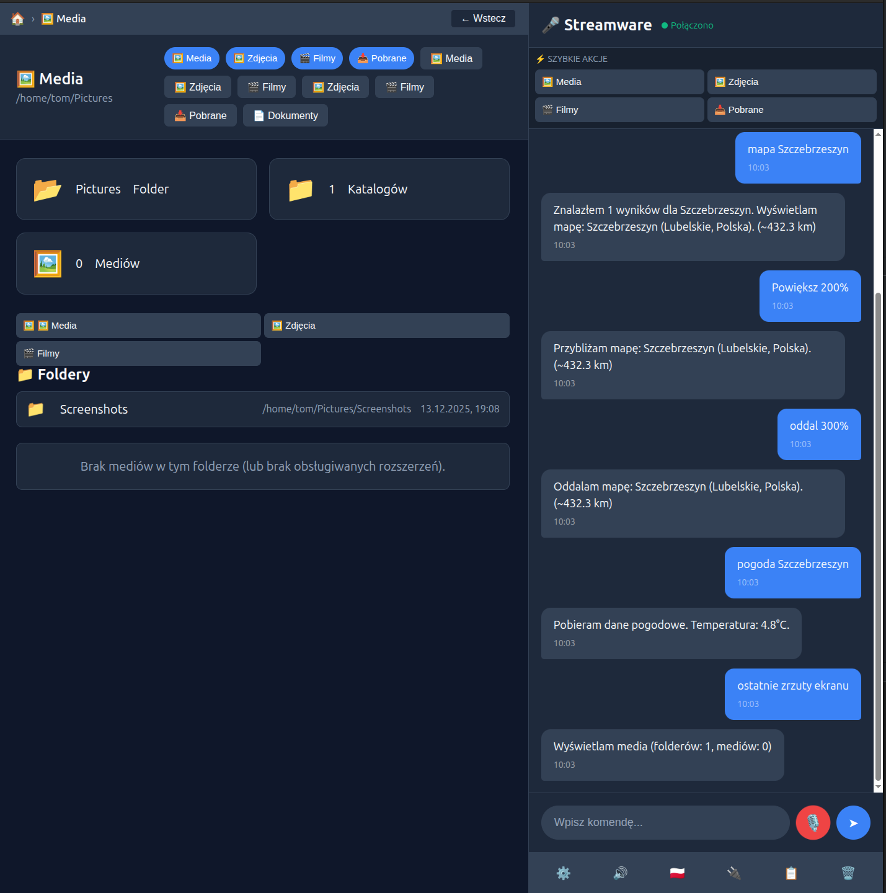

# Streamware - Voice-Controlled Dashboard Platform

🚀 **Streamware** to platforma do zarządzania aplikacjami sterowana głosowo, z integracjami internetowymi, OCR, monitoringiem i AI.

> "Mów co chcesz - system wykonuje"

## 📋 Spis treści

- [Szybki start](#szybki-start)
- [Funkcjonalności](#funkcjonalności)
- [Struktura projektu](#struktura-projektu)
- [Instalacja](#instalacja)
- [Testowanie](#testowanie)
- [Aplikacje](#aplikacje)
- [API](#api)
- [Dokumentacja](#dokumentacja)

## 🚀 Szybki start

```bash
# Klonuj repozytorium
git clone https://github.com/stream-ware/appchat.git
cd stream-ware/appchat

# Uruchom serwer
make start

# Otwórz w przeglądarce
http://localhost:8001
```

## ✨ Funkcjonalności

### 🎤 Sterowanie głosowe
- Komendy w języku polskim
- Rozpoznawanie intencji
- Real-time odpowiedzi

### 🌐 Integracje internetowe
- **Pogoda**: Open-Meteo API
- **Kryptowaluty**: CoinGecko API  
- **Kursy walut**: NBP API
- **RSS**: BBC, Ars Technica, Hacker News
- **Email**: SMTP status
- **MQTT**: Pub/Sub messaging
- **Webhooks**: HTTP callbacks

### 📄 Dokumenty i OCR
- Przetwarzanie faktur
- Ekstrakcja danych (NIP, kwoty, daty)
- Mock OCR dla testów
- Tesseract support (opcjonalnie)

### 🎥 Monitoring CCTV
- Kamery RTSP/ONVIF
- Detekcja ruchu
- Status online/offline
- OpenCV integration

### ☁️ Cloud Storage
- OneDrive, Nextcloud, Google Drive
- Formularze połączeń
- Sync plików
- Status połączeń

### 🤖 AI i LLM
- Ollama integration
- CurlLLM queries
- Model management
- Chat history

### 📊 Diagnostyka systemu
- Health checks
- Status aplikacji
- Testy integracji
- Raporty

## 📁 Struktura projektu

```
stream-ware/appchat/
├── backend/                 # FastAPI backend
│   ├── main.py             # Główna aplikacja
│   ├── database.py         # SQLite baza danych
│   ├── config.py           # Konfiguracja
│   └── *.py                # Moduły backendu
├── frontend/               # HTML/CSS/JS frontend
│   └── index.html          # Główny interfejs
├── apps/                   # Aplikacje biznesowe
│   ├── documents/          # Dokumenty i OCR
│   ├── cameras/            # Monitoring CCTV
│   ├── sales/              # Sprzedaż i CRM
│   ├── home/               # Smart Home
│   └── analytics/          # Analityka
├── services/               # Serwisy systemowe
│   ├── diagnostics/        # Diagnostyka
│   ├── integrations/       # Integracje zewnętrzne
│   └── llm/               # LLM management
├── client/                 # Shell client
│   └── shell_client.py     # CLI test runner
├── tests/                  # Testy automatyczne
│   ├── test_*.py          # Test suites
│   └── Makefile           # Test commands
└── data/                   # Dane aplikacji
    ├── apps_config.json   # Konfiguracja apps
    └── documents/         # Przetworzone dokumenty
```

## 🔧 Instalacja

```bash
# 1. Tworzenie wirtualnego środowiska
python3 -m venv venv
source venv/bin/activate

# 2. Instalacja zależności
pip install -r requirements.txt

# 3. Inicjalizacja bazy danych
python -c "from backend.database import db; db.init()"

# 4. Uruchomienie serwera
python backend/main.py
```

### Zależności opcjonalne

```bash
# OCR (Tesseract)
sudo apt-get install tesseract-ocr tesseract-ocr-pol
pip install pytesseract

# OpenCV (kamery)
pip install opencv-python

# AI/LLM
pip install ollama
```

## 🧪 Testowanie

### GUI/E2E Tests
```bash
cd tests
make gui              # GUI tests (wymaga serwera)
make gui-url URL=http://localhost:8001
```

### Shell Client Tests
```bash
cd tests
make shell            # Wszystkie testy
make shell-basic      # Testy podstawowe
make shell-internet   # Integracje internetowe
make shell-cloud      # Cloud storage
make shell-files      # Zarządzanie plikami
make shell-diagnostic # Diagnostyka
```

### Integracje
```bash
cd tests
make integration      # Testy integracji
make ocr             # OCR integration
make views           # View rendering
```

### Pełny CI
```bash
cd tests
make ci              # Quick CI
make ci-full         # Full CI suite
```

## 📱 Aplikacje

### 📄 Documents
- OCR przetwarzanie faktur
- Ekstrakcja danych
- Mock data dla testów
- Status: ✅ Functional

### 🎥 Cameras  
- RTSP/ONVIF kamery
- Motion detection
- Dashboard statusów
- Status: ✅ Functional

### 📊 Sales
- Dashboard sprzedaży
- KPI i raporty
- CRM integration (placeholder)
- Status: ⚠️ Placeholder

### 🏠 Home
- Smart Home control
- IoT devices
- Temperature/lighting
- Status: ⚠️ Placeholder

### 📈 Analytics
- Dashboard analityczny
- Google Analytics
- Custom metrics
- Status: ⚠️ Placeholder

## 🔌 API

### REST Endpoints
```bash
# Health check
GET /api/health

# Apps i commands
GET /api/apps
GET /api/commands

# Diagnostyka
GET /api/diagnostics
GET /api/diagnostics/quick

# Command processing
POST /api/command/send
```

### WebSocket
```javascript
// Połączenie WebSocket
const ws = new WebSocket('ws://localhost:8001/ws');

// Wysyłanie komendy głosowej
ws.send(JSON.stringify({
    type: 'voice_command',
    text: 'pokaż pogodę'
}));
```

## 📚 Dokumentacja

### [Dokumentacja techniczna](docs/)
- [Architecture](docs/architecture.md)
- [API Reference](docs/api.md)
- [Development Guide](docs/development.md)
- [Deployment](docs/deployment.md)

### [Test documentation](tests/README.md)
- [Test strategies](tests/README.md#strategies)
- [Writing tests](tests/README.md#writing-tests)
- [CI/CD](tests/README.md#ci-cd)

## 🎯 Komendy głosowe

### System
- `start` - Ekran startowy
- `pomoc` - Pomoc i dostępne komendy
- `status` - Status systemu

### Dokumenty
- `pokaż faktury` - Lista dokumentów
- `zeskanuj fakturę` - Nowy dokument
- `suma faktur` - Suma kwot

### Monitoring
- `pokaż kamery` - Podgląd kamer
- `gdzie ruch` - Detekcja ruchu
- `nagraj` - Rozpocznij nagrywanie

### Internet
- `pogoda` - Pogoda aktualna
- `pogoda kraków` - Pogoda dla lokalizacji
- `kursy walut` - Kursy EUR/USD
- `bitcoin` - Cena kryptowalut

### Cloud
- `chmura` - Status cloud storage
- `połącz onedrive` - Połączenie z OneDrive
- `sync pliki` - Synchronizacja

## 🛠️ Development

### Dodawanie nowych aplikacji
1. Utwórz folder w `apps/`
2. Dodaj logikę biznesową
3. Zarejestruj w `backend/main.py`
4. Dodaj komendy w `data/apps_config.json`

### Testowanie nowych funkcji
```bash
# Shell client test
python client/shell_client.py "nowa komenda"

# GUI test
make gui

# Integration test
make integration
```

## 📈 Status projektu

- ✅ **Core functionality** - Working
- ✅ **Voice commands** - Working  
- ✅ **Internet integrations** - Working
- ✅ **Documents OCR** - Working
- ✅ **Cameras RTSP** - Working
- ✅ **Diagnostics** - Working
- ⚠️ **Sales CRM** - Placeholder
- ⚠️ **Smart Home** - Placeholder
- ⚠️ **Analytics** - Placeholder

**Health Score**: 46.4% (13/28 features functional)

## 🤝 Współpraca

1. Fork projektu
2. Utwórz branch feature
3. Commit changes
4. Push to branch
5. Create Pull Request

## 📄 Licencja

Apache License - zobacz [LICENSE](LICENSE) file.

---

🚀 **Streamware** - Twój głosowy system zarządzania
